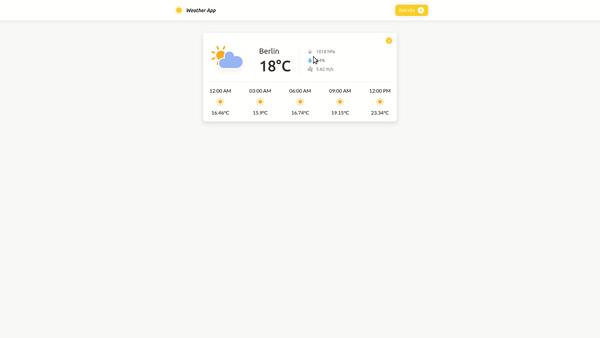

## Table of contents

- [General info](#general-info)
- [TODO](#todo)
- [Screenshots](#screenshots/gif)
- [Technologies](#technologies)
- [Setup](#setup)

## General info

Small Weather API that uses external API to get weather information based on user location and provided city name.

## TODO

Some things need to be done, like icons should match the weather.

## Screenshots/GIF



## Technologies

Project is created with:

- JavaScript
- CSS
- HTML

## Setup

First of all, You need to get your personal API key from [here](https://openweathermap.org/api).

When You obtain your API key You can run this project, clone it and simply open index.html file in your browser:

```
$ git clone https://github.com/pielarz/weather-app.git
$ cd weather-app/app
$ xdg-open index.html
```
